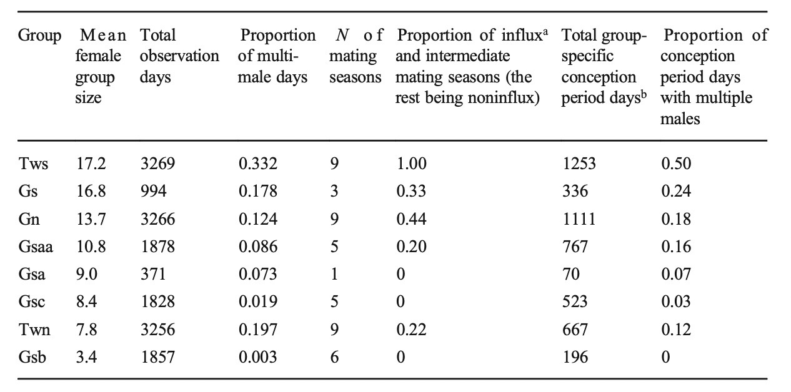
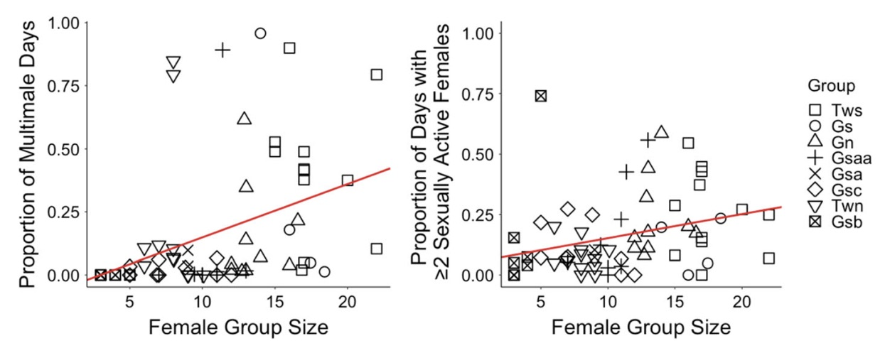

```{r setup, include=FALSE}
knitr::opts_chunk$set(warning = FALSE, message = FALSE) 
```

### Preliminary Setup:
```{r, prelims}
library(curl)
library(tidyverse)
library(lubridate, warn.conflicts = FALSE)
library(broom.mixed)
library(ggplot2)
library(gridExtra)
library(tidyr)
library(MCMCglmm)
library(lme4)
library(ggplot2)
```


## Introduction: 


## Data Importation: 
```{r}
f <- curl("https://raw.githubusercontent.com/rhottensomers/reesehs-data-replication-assignment/main/doi_10.5061_dryad.kkwh70s31__v4%202/Gao_Cords_2020_IJP_Dataset1_Daily_data.csv") #imports data about zombies
d1 <- read.csv(f, header = TRUE, sep = ",", stringsAsFactors = FALSE)  #reads data and creates data frame from it
head(d1) #returns data frame
str(d1)
names(d1)#mating season and conception period and group as factor, n of sex fs and males in group switch to NA and then convert to factor

d1$N.sex.active.females <- na_if(d1$N.sex.active.females,"ND")
d1$N.males.in.group <-  na_if(d1$N.males.in.group,"ND")
d1$Mating.season <- na_if(d1$Mating.season, "ND")

#d1$Group <- as.factor(d1$Group)
d1$Mating.season <- as.factor(d1$Mating.season)
d1$Conception.period <- as.factor(d1$Conception.period)


d1$N.sex.active.females <- as.numeric(d1$N.sex.active.females)
d1$N.males.in.group <- as.numeric(d1$N.males.in.group)
d1$Date <- mdy(d1$Date)
str(d1)
view(d1)


mmd <- sum(d1$N.males.in.group >= 2, na.rm = TRUE)

mmd/nrow(d1) * 100 #percent of days with multiple male 

view(d1)
```

```{r}
#variables needed for GLMMs

#"test whether larger groups were more likely to contain multiple males and multiple sexually active females per day across group-specific conception periods, we used binomial-family generalized linear mixed models (GLMMs) with a logit- link function and group as a random effect."

#predictor: mean daily f group size

#dependent: proportion of days(during conception period) when a group contain either: more than two males or more than two sexually active females
```

## Code for Separating Conception Periods:
```{r, initial_sep}

d1 <- d1 %>% mutate(Mbin = case_when(N.males.in.group < 2 ~ "<2",N.males.in.group >= 2 ~ "2+"))

summary(as.factor(d1$Mbin))
#d1 <- filter(d1, Conception.period == "YES" )

head(d1)


d1 <- d1 %>% mutate(Fbin = case_when(N.sex.active.females < 2 ~ "<2F",N.sex.active.females >= 2 ~ "2+F"))
head(d1)
view(d1)

# a: 2006-06-26- 2006-08-16, Gn
df2 <- d1[c(177:228),]
view(df2)
names(df2)

fdf <- data.frame("Gn", mean(df2$Female.Group.Size),  sum(df2$Mbin == "2+")/length(df2$Conception.period), sum(df2$Fbin == "2+F")/length(df2$Conception.period))
names(fdf) <- c("GroupNames", "Mean.Female.Group.Size", "Proportion.of.Two.Plus.Male.Days", "Proportion.of.Two.Plus.SA.Female.Days")
head(fdf)

```

```{r, function}
calc <- function(f) {
  m <- (mean(f$Female.Group.Size))
  s1 <- (sum(f$Mbin == "2+", na.rm = TRUE)/length(f$Conception.period))
  s2 <- (sum(f$Fbin == "2+F", na.rm = TRUE)/length(f$Conception.period))
  n <- f[1,2]
  new_row = c(n, m, s1, s2)
  return(new_row)
}
```


```{r, rest_sep, echo=T, class.source = 'fold-hide'}

# b: 2007-06-09 - 2007-12-15, Gn 
b <- d1[c(525:714),]
fdf <- rbind(fdf, calc(b))

# c: 2008-06-18 - 2008-11-01
c <- d1[c(900:1036),]
fdf <- rbind(fdf, calc(c))

# d: 2009-06-13- 2009-10-03
d <- d1[c(1260:1372),]
fdf <- rbind(fdf, calc(d))

# e: 2010-07-03 - 2010-09-20
e <- d1[c(1645:1724),]
fdf <- rbind(fdf, calc(e))

# f: 2012-01-20 - 2012-02-17
f <- d1[c(2211:2239),]
fdf <- rbind(fdf, calc(f))

# g: 2012-07-23 - 2012-11-26
g <- d1[c(2396:2522),]
fdf <- rbind(fdf, calc(g))

# h: 2013-03-01 - 2013-04-05
h <- d1[c(2617:2652),]
fdf <- rbind(fdf, calc(h))

# i: 2013-06-20 - 2013-11-22
i <- d1[c(2728:2883),]
fdf <- rbind(fdf, calc(i))

# j: 2014-04-25 - 2014-11-01
j <- d1[c(3037:3227),]
fdf <- rbind(fdf, calc(j))

# k: 2006-06-10 - 2006-11-11, Gs
k <- d1[c(3448:3602),]
fdf <- rbind(fdf, calc(k))

# l: 2007-06-11 - 2007-09-01
l <- d1[c(3814:3896),]
fdf <- rbind(fdf, calc(l))

# m: 2007-12-11 - 2008-01-08
m <- d1[c(3997:4025),]
fdf <- rbind(fdf, calc(m))

# n: 2008-06-30 - 2008-09-08
n <- d1[c(4199:4269),]
fdf <- rbind(fdf, calc(n))

# o: 2008-10-28 - 2008-11-25, Gsa
o <- d1[c(4319:4347),]
fdf <- rbind(fdf, calc(o))

# p: 2009-06-05 - 2009-07-16
p <- d1[c(4539:4580),]
fdf <- rbind(fdf, calc(p))

# q: 2009-10-11 - 2009-10-29, Gsaa
q <- d1[c(4667:4685),]
fdf <- rbind(fdf, calc(q))

# r: 2010-04-03 - 2010-05-01
r <- d1[c(4841:4869),]
fdf <- rbind(fdf, calc(r))

# s: 2010-06-21 - 2010-08-26
s <- d1[c(4920:4986),]
fdf <- rbind(fdf, calc(s))

# t: 2011-02-10 - 2011-12-13
t <- d1[c(5154:5460),]
fdf <- rbind(fdf, calc(t))

# u: 2012-07-21 - 2012-11-17
u <- d1[c(5681:5800),]
fdf <- rbind(fdf, calc(u))

# v: 2013-05-19 - 2013-09-25
v <- d1[c(5983:6112),]
fdf <- rbind(fdf, calc(v))

# w: 2014-03-06 - 2014-05-27
w <- d1[c(6274:6356),]
fdf <- rbind(fdf, calc(w))

# x: 2014-07-31 - 2014-08-28
x <- d1[c(6421:6449),]
fdf <- rbind(fdf, calc(x))

# y: 2008-10-03 - 2008-11-02, Gsb
y <- d1[c(6575:6605),]
fdf <- rbind(fdf, calc(y))

# z: 2010-03-25 - 2010-04-22
z <- d1[c(7113:7141),]
fdf <- rbind(fdf, calc(z))

# a1: 2010-06-28 - 2010-07-26
a1 <- d1[c(7208:7236),]
fdf <- rbind(fdf, calc(a1))

# b1: 2011-06-09 - 2011-07-07
b1 <- d1[c(7554:7582),]
fdf <- rbind(fdf, calc(b1))

# c1: 2011-12-01 - 2011-12-29
c1 <- d1[c(7729:7757),]
fdf <- rbind(fdf, calc(c1))

# d1: 2012-05-01 - 2012-05-29
done <- d1[c(7881:7909),]
fdf <- rbind(fdf, calc(done))

# e1: 2013-06-08 - 2013-07-06
e1 <- d1[c(8284:8312),]
fdf <- rbind(fdf, calc(e1))

# f1: 2014-02-23 - 2014-03-23
f1 <- d1[c(8544:8572),]
fdf <- rbind(fdf, calc(f1))

# g1: 2010-06-20 - 2010-08-21, Gsc
g1 <- d1[c(9108:9170),]
fdf <- rbind(fdf, calc(g1))

# h1: 2010-10-24 - 2010-11-21
h1 <- d1[c(9234:9262),]
fdf <- rbind(fdf, calc(h1))

# i1: 2011-01-27 - 2011-02-24
i1 <- d1[c(9329:9357),]
fdf <- rbind(fdf, calc(i1))

# j1: 2011-05-11 - 2011-07-15
j1 <- d1[c(9433:9498),]
fdf <- rbind(fdf, calc(j1))

# k1: 2011-12-12 - 2012-01-09
k1 <- d1[c(9648:9676),]
fdf <- rbind(fdf, calc(k1))

# l1: 2012-05-26 - 2012-10-13
l1 <- d1[c(9814:9954),]
fdf <- rbind(fdf, calc(l1))

# m1: 2013-03-01 - 2013-03-29
m1 <- d1[c(10093:10121),]
fdf <- rbind(fdf, calc(m1))

# n1: 2013-05-07 - 2013-08-21
n1 <- d1[c(10160:10266),]
fdf <- rbind(fdf, calc(n1))

# o1: 2014-08-15 - 2014-09-26
o1 <- d1[c(10625:10667),]
fdf <- rbind(fdf, calc(o1))

# p1: 2006-07-14 - 2006-08-15, Twn 
p1 <- d1[c(10958:10990),]
fdf <- rbind(fdf, calc(p1))

# q1: 2007-10-05 - 2007-11-02
q1 <- d1[c(11406:11434),]
fdf <- rbind(fdf, calc(q1))

# r1: 2008-07-15 - 2008-09-04
r1 <- d1[c(11690:11741),]
fdf <- rbind(fdf, calc(r1))

# s1: 2009-08-01 - 2009-10-23
s1 <- d1[c(12072:12155),]
fdf <- rbind(fdf, calc(s1))

# t1: 2010-07-10 - 2010-09-12
t1 <- d1[c(12415:12479),]
fdf <- rbind(fdf, calc(t1))

# u1: 2011-04-26 - 2011-06-23
u1 <- d1[c(12705:12763),]
fdf <- rbind(fdf, calc(u1))

# v1: 2011-08-17 - 2011-09-14
v1 <- d1[c(12818:12846),]
fdf <- rbind(fdf, calc(v1))

# w1: 2012-08-04 - 2012-11-07
w1 <- d1[c(13171:13266),]
fdf <- rbind(fdf, calc(w1))

# x1: 2013-03-03 - 2013-03-31
x1 <- d1[c(13382:13410),]
fdf <- rbind(fdf, calc(x1))

# y1: 2013-07-16 - 2013-08-14
y1 <- d1[c(13517:13546),]
fdf <- rbind(fdf, calc(y1))

# z1: 2014-04-03 - 2014-05-01
z1 <- d1[c(13778:13806),]
fdf <- rbind(fdf, calc(z1))

# a2: 2014-06-09 - 2014-10-21
a2 <- d1[c(13845:13979),]
fdf <- rbind(fdf, calc(a2))

# b2: 2006-06-10 - 2006-08-24, Tws
b2 <- d1[c(14211:14286),]
fdf <- rbind(fdf, calc(b2))

# c2: 2007-08-03 - 2007-11-04
c2 <- d1[c(14630:14723),]
fdf <- rbind(fdf, calc(c2))

# d2: 2008-07-10 - 2008-10-15
dtwo <- d1[c(14972:15069),]
fdf <- rbind(fdf, calc(dtwo))

# e2: 2008-12-16 - 2009-02-15
e2 <- d1[c(15131:15192),]
fdf <- rbind(fdf, calc(e2))

# f2: 2010-01-04 - 2010-02-01
f2 <- d1[c(15515:15543),]
fdf <- rbind(fdf, calc(f2))

# g2: 2010-04-26 - 2010-09-15
g2 <- d1[c(15627:15769),]
fdf <- rbind(fdf, calc(g2))

# h2: 2010-12-27 - 2011-02-15
h2 <- d1[c(15872:15922),]
fdf <- rbind(fdf, calc(h2))

# i2: 2011-05-05 - 2011-12-11
i2 <- d1[c(16001:16221),]
fdf <- rbind(fdf, calc(i2))

# j2: 2012-07-28 - 2012-11-23 
j2 <- d1[c(16451:16569),]
fdf <- rbind(fdf, calc(j2))

# k2: 2013-05-30 - 2013-10-20
k2 <- d1[c(16757:16900),]
fdf <- rbind(fdf, calc(k2))

# l2: 2014-04-06 - 2014-05-04
l2 <- d1[c(17068:17096),]
fdf <- rbind(fdf, calc(l2))

# m2: 2014-06-25 - 2014-12-31
m2 <- d1[c(17148:17337),]
fdf <- rbind(fdf, calc(m2))

head(fdf)

fdf$GroupNames <- as.factor(fdf$GroupNames )
names(fdf)

fdf$Mean.Female.Group.Size <- as.numeric(fdf$Mean.Female.Group.Size)
fdf$Proportion.of.Two.Plus.Male.Days <- as.numeric(fdf$Proportion.of.Two.Plus.Male.Days)
fdf$Proportion.of.Two.Plus.SA.Female.Days <- as.numeric(fdf$Proportion.of.Two.Plus.SA.Female.Days)
view(fdf)
names(fdf)

str(fdf)
```
## Table 1: 
```{r, table stats}
#Gs
dfgs <- filter(d1, Group == "Gs" )

#Gn
dfgn <- filter(d1, Group == "Gn" )

#Gsaa
dfgsaa <- filter(d1, Group == "Gsaa" )

#Gsa
dfgsa <- filter(d1, Group == "Gsa" )

#Gsc
dfgsc <- filter(d1, Group == "Gsc" )

#Twn
dftwn <- filter(d1, Group == "Twn" )

#Gsb
dfgsb <- filter(d1, Group == "Gsb" )

#Tws
dftws <- filter(d1, Group == "Tws" )

```

```{r, table_function}

tdf <- data.frame("Tws",sum(dftws$Female.Group.Size)/length(dftws$Female.Group.Size), length(dftws$Group), sum(dftws$Mbin == "2+", na.rm = TRUE)/length(dftws$Mbin), sum(dftws$Conception.period == "YES"))
names(tdf) <- c("Group", "Mean female group size", "Total observation days", "Proportion of multimale days", "Total group-specific conception period days")
dftws <- filter(dftws, Conception.period == "YES" )

tdf$`Proportion of conception period days with.multiple males` <- sum(dftws$Mbin == "2+", na.rm = T)/length(dftws$Mbin)


table <- function(f){
  gn <- f[1,2]
  mfgs <- sum(f$Female.Group.Size)/length(f$Female.Group.Size)
  od <- length(f$Group)
  pmmd <- sum(f$Mbin == "2+", na.rm = TRUE)/length(f$Group)
  cpd <-  sum(f$Conception.period == "YES" )
  f <- filter(f, Conception.period == "YES" )
  mmcpd <-  sum(f$Mbin == "2+", na.rm = TRUE)/length(f$Mbin)
  new_dfrow = c(gn, mfgs, od, pmmd, cpd, mmcpd)
  return(new_dfrow)
}

tdf <- rbind(tdf, table(dfgs))
tdf <- rbind(tdf, table(dfgn))
tdf <- rbind(tdf, table(dfgsaa))
tdf <- rbind(tdf, table(dfgsa))
tdf <- rbind(tdf, table(dfgsc))
tdf <- rbind(tdf, table(dftwn))
tdf <- rbind(tdf, table(dfgsb))
head(tdf, n = 8)

str(tdf)

tdf$`Mean female group size` <- as.numeric(tdf$`Mean female group size`)
tdf$`Proportion of multimale days` <- as.numeric(tdf$`Proportion of multimale days`)
tdf$`Total group-specific conception period days` <- as.numeric(tdf$`Total group-specific conception period days`)
tdf$`Proportion of conception period days with.multiple males` <- as.numeric(tdf$`Proportion of conception period days with.multiple males`)

tdf$`Mean female group size` <- round(tdf$`Mean female group size`, digits = 1)
tdf$`Proportion of multimale days` <- round(tdf$`Proportion of multimale days`, digits = 3)
tdf$`Proportion of conception period days with.multiple males` <- round(tdf$`Proportion of conception period days with.multiple males`, digits = 2)


knitr::kable(tdf)
```





## GLMMs: 

For this data replication I decided to replicate two GLMMs that described whether a particular group was more likely to include multiple(more than two) males or multiple sexually active females during the already defined 65 conception periods. This required two GLMMs: one that looked at multiple males and group size, and another that looked at multiple sexual active females and group size. The GLMMs themselves as states within the statistics section of the article were binomial family and thus used a logit-link function and group as a random effect. The predictor values being mean female group size during each conception period and proportion of days during conception periods where there were multiple males or sexual active females  However, it was not stated whether they used intercept or slope form for their GLMMs. So I decided to run both to see if one fit the data better, and the intercept form resulted with a better AIC(52.2 vs 56.2). I will first begin with the multiple male GLMM below: 

### Multi-male GLMM: 
In the results section of the article it was stated that their GLMM resulted in these values: β = 0.021, 95% CI [0.007, 0.034], P = 0.015. In this section I will run the GLMM and attempt to receive the same or similar numbers. 
```{r, glmms}
mglmm <-glmer( Proportion.of.Two.Plus.Male.Days ~ Mean.Female.Group.Size + (1 | GroupNames), family = binomial, data = fdf) #intercept form of multi-male GLMM with binomial link and fdf data frame of conception periods

summary(mglmm) #returns glmm

null <- glmer(Proportion.of.Two.Plus.Male.Days ~ 1 +  (1|GroupNames), family = binomial(link = "logit"), data = fdf) #reduced or null version of the GLMM used for liklihood ratio test

anova(null, mglmm, test = "Chisq") #liklihood ratio test and returns p value

exp(confint(mglmm, parm = "Mean.Female.Group.Size")) #returns 95% confidence intervals
```

Discussion, discussion

```{r, mslope}
smglmm <- glmer( Proportion.of.Two.Plus.Male.Days ~ Mean.Female.Group.Size + (1 + Mean.Female.Group.Size | GroupNames), family = binomial(link = "logit"), data = fdf) #slope form of multi-male GLMM
summary(smglmm) #returns glmm 
```

AIC values etc

```{r, lmm}
mlmer <- lmer(data = fdf, Proportion.of.Two.Plus.Male.Days ~ Mean.Female.Group.Size + (1|GroupNames), REML = FALSE) #linear mixed model version of mutli-male GLMM
summary(mlmer) #returns multi-male lmm
coefficients(mlmer)

nmlmer <- lmer(data = fdf, Proportion.of.Two.Plus.Male.Days ~ 1 + (1|GroupNames), REML = FALSE) #reduced form of linear mixed model

anova(nmlmer, mlmer, test = "Chisq") #likelihood ratio test

confint(mlmer, level = .95)
```

### Multiple Sexually Active Female GLMM: 

Also in the results section the multi-sexually active female GLMM results were given: β = 0.010, 95% CI [0.002, 0.018], P = 0.017. In this next section I will again attempt to recieve similar numbers from my own GLMMs. 

```{r, fglmms}
fglmm <- glmer( Proportion.of.Two.Plus.SA.Female.Days ~ Mean.Female.Group.Size + (1 | GroupNames), family =binomial(link = "logit"), data = fdf) #
summary(fglmm)

nflgmm <- glmer( Proportion.of.Two.Plus.SA.Female.Days ~ 1 + (1|GroupNames), family =binomial(link = "logit"), data = fdf)#reduced version


anova(nflgmm, fglmm, test = "Chisq")#likelihood ratio test fr

exp(confint(fglmm, parm = "Mean.Female.Group.Size")) # 95% confidence interval


```

wow, this one is weird too!

```{r, sfglmm}
glmer( Proportion.of.Two.Plus.SA.Female.Days ~ Mean.Female.Group.Size + (1 + Mean.Female.Group.Size | GroupNames), family =binomial(link = "logit"), data = fdf)
```

AIC yadaydad

```{r, flmms}
flmm <- lmer(data = fdf, Proportion.of.Two.Plus.SA.Female.Days ~ Mean.Female.Group.Size + (1|GroupNames), REML = FALSE)
summary(flmm)

nflmm <- lmer(data = fdf, Proportion.of.Two.Plus.SA.Female.Days ~ 1 + (1|GroupNames), REML = FALSE)

anova(nflmm, flmm, test = "Chisq")

confint(flmm,level = .95) # 95% confidence interval 
```


## Graphs ultilizing GLMMs: 


```{r, plotting1}
fdf$prediction1 <- predict(mglmm, type = "response", newdata = fdf) #adds prediction line using the mutli-male GLMM

p1 <- ggplot(data = fdf, aes(x = Mean.Female.Group.Size, y = Proportion.of.Two.Plus.Male.Days, shape = GroupNames)) + geom_point() + scale_shape_manual( values = c(2,1,4,3,7,5,6,0)) +  geom_abline(slope = .02178, intercept = -0.06905, color = "red") + ylab("Proportion of Multimale Days") + xlab("Female Group Size") + geom_line(data = fdf, aes(x = Mean.Female.Group.Size, y = prediction1), color = "blue") +  scale_color_manual(name = "Models", values = c("Linear Mixed Model" = "red", "GLMM" = "blue")) +theme(legend.direction = "vertical", legend.box = "vertical") #plots conception period data along with the linear mixed model and the GLMM lines
```


```{r, plotting2}
fdf$prediction2 <- predict(fglmm, type = "response", newdata = fdf)#adds prediction line for mutli-sa female GLMM

p2 <- ggplot(data = fdf, aes(x = Mean.Female.Group.Size, y = Proportion.of.Two.Plus.SA.Female.Days, shape = GroupNames )) + geom_point() + ylim(0, 1) + scale_shape_manual( values = c(2,1,4,3,7,5,6,0)) + geom_abline(slope = 0.01061 , intercept = 0.04214, color = "red" ) + ylab("Proportion of Days with ≥2 Sexual Active Females") + xlab("Female Group Size") + geom_line(data = fdf, aes(x = Mean.Female.Group.Size, y = prediction2), color = "blue")
```




```{r, plottingp1}
p1
```


```{r, plottingp2}
p2

```


