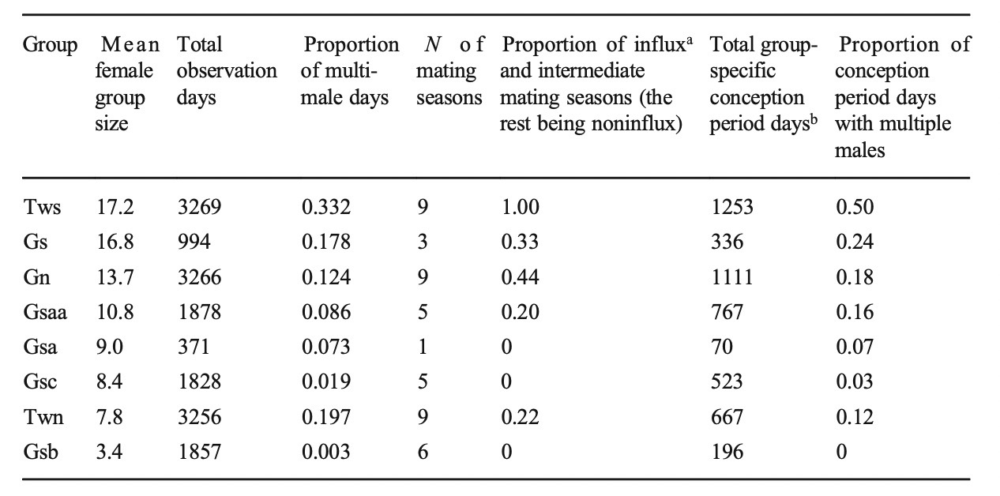
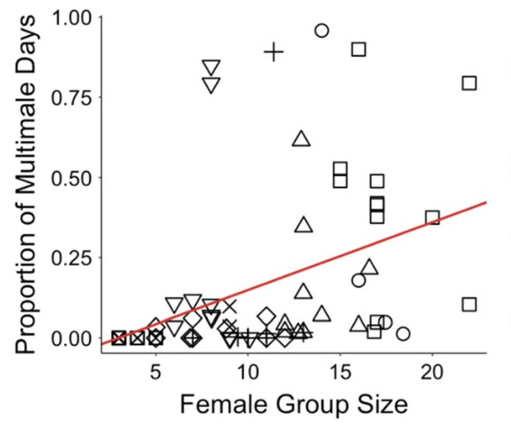
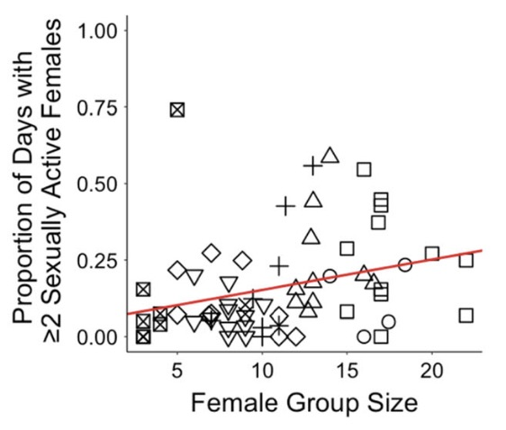

```{r setup, include=FALSE}
knitr::opts_chunk$set(warning = FALSE, message = FALSE) 
```


\

## Introduction:

For my data replication assignment I decided to replicated analyses from "Effects of Female Group Size on the Number of Males in Blue Monkey (Cercopithecus mitis) Groups" by Lu Gao & Marina Cords. Blue monkeys normally live in a group setting with multiple females but not multiple males. During mating and conception periods males may join the group for a time to mate with females before leave. This paper investigated how well female group size of the blue monkeys could predict the movement of males in and out of the groups specifically during mating and conception periods. They specifically studied 8 different groups within Kakamega Forest in Kenya from 2006-2014. The data set that I used was sourced from the corresponding [dryad page](https://datadryad.org/stash/dataset/doi:10.5061/dryad.kkwh70s31). I determined that I would only need the first data set as all my analyses would correspond to conception period. 

Looking specially at conception periods Gao & Cords used a binomal family generalized linear mixed models(glmms) to determined the relationship between female group size as a predictor for number of males and sexually active females within the group during conception periods. Using the glmm and the data from each conception period they created a scatterplot that graphed the glmm line onto the data. As well they compiled a table that contained information about each group  stating the number of days observed, the mean group size, and proportion of multimale days. And then separating out just observed day during the conception periods they calculated the number of day, and proportion of days with multiple males. For this assignment I will be replicating all calculations within table 1, the two glmms(multi males and sexually active females), and the graph. 


### Preliminary Setup:

```{r, prelims}
library(curl)
library(tidyverse)
library(lubridate, warn.conflicts = FALSE)
library(broom.mixed)
library(ggplot2)
library(gridExtra)
library(tidyr)
library(MCMCglmm)
library(lme4)
library(ggplot2)
```

## Data Importation:

Using dryad I was able to find the cooresponding data for the paper. There were two excel data sheets and I put both in my project folder and uploaded them to github. The second dataset sheet contained information about individuals within the group which I would not be using for my analyzes. I thus decided to not import it but it is still within the project file just incase. Once uploaded to github it was easy to curl in datasheet 1.

```{r, import}
f <- curl("https://raw.githubusercontent.com/rhottensomers/reesehs-data-replication-assignment/main/Datasheets/Gao_Cords_2020_IJP_Dataset1_Daily_data.csv") #imports data from paper dataset 1
d1 <- read.csv(f, header = TRUE, sep = ",", stringsAsFactors = FALSE)  #reads data and creates data frame from it
head(d1, 4) #returns first 4 rows of data frame d1
```

This datasheet contains data from each observation day, of which there were 16,719. Each data entry contains the group, number of sexually active females and males in the group, whether it was a mating season or conception period, and the female group size. After importing I needed to assess how the data was structured and manipulate it so it would be ready of analyses.

```{r}
str(d1) #structure of dataframe

#r does not understhand ND so I converted all NDs to NAs within the dataframe
d1$N.sex.active.females <- na_if(d1$N.sex.active.females,"ND")
d1$N.males.in.group <-  na_if(d1$N.males.in.group,"ND")
d1$Mating.season <- na_if(d1$Mating.season, "ND")

#converts mating season and conception periods into factored values
d1$Mating.season <- as.factor(d1$Mating.season)
d1$Conception.period <- as.factor(d1$Conception.period)

#converting in numbers instead of characters as it will be easier to use with anlayses 
d1$N.sex.active.females <- as.numeric(d1$N.sex.active.females)
d1$N.males.in.group <- as.numeric(d1$N.males.in.group)

#using lubridate to convert the dates into month, day, year formula
d1$Date <- mdy(d1$Date)

#check that each column is in desired structure
str(d1)

head(d1, 1)
```

Now that the data was in my desired structure I decided to do an initial analysis regarding the number of group observational days that were multimale days. The article stated that it was 15% of days, however, my answer differed slightly. 

```{r, mmd}
#finds the number of days where the number of males in group is greater than or equal to two which removing nas
mmd <- sum(d1$N.males.in.group >= 2, na.rm = TRUE)

mmd/nrow(d1) * 100 #finds percent of days with multiple male 

```

While 14.616% is slightly lower than the expected value, it is not by much. Most likely there was data that was excluded but not reported. Or it was rounding. 

The determining factors of the analyses that will be run rely on knowing if there are multiple males or multiple sexually active female an each day of data. The data has the number of each factor in their own column, N.males.in.group and N.sex.active.females, however, I needed to divide the numbers into two groups: those less than two and those equal to or above two(how the authors describe multiple). In order to acomplish this I used tidverse bins to separate the numbers. This created two new columns: Mbin and Fbin that label whether that day contains 2(+) or <2 of each factor.

```{r, bins}
d1 <- d1 %>% mutate(Mbin = case_when(N.males.in.group < 2 ~ "<2",N.males.in.group >= 2 ~ "2+"))

d1 <- d1 %>% mutate(Fbin = case_when(N.sex.active.females < 2 ~ "<2F",N.sex.active.females >= 2 ~ "2+F"))

head(d1)
```
</br>

\

</br>

## Code for Separating Conception Periods:


The statistics that I will be looking at pertain conception periods. However, it is not just conception periods overall, but proportions of multiple males or sexually active females in each group during each individual conception period. The article reported that they found 65 conception periods, however, they do not explicitly state when they are, only indicating within the data a 'yes' or 'no' if the date was in a conception period. Because of this, I need to be able to separate out each individual conception period and run analysis on each one. Although there is most likely a more efficient way of separating out each conception period, I manually went through and found the start and end date and row numbers. As well, there ended up by multiple entries for each day so I kept the data not by date but by group name in order to separate the data correctly. 

I ultimately decided to separate each conception period into a dataframe, and perform these analyses about the conception period itself: mean female group size, proportion of multi male days, proportion of multi sexually active female days, and report the group name as well. These would then be added to a new data frame called fdf.  

```{r, initial_sep}
#for simplicity sake I assigned each subsetted conception period to a new dataframe starting with a

# a: 2006-06-26- 2006-08-16, Gn (start and end dates and what group it corresponds to)

df2 <- d1[c(177:228),] #rows 177 to 228 of datasheet dataframe 1

#I then created the final dataframe that I would use for analyses

fdf <- data.frame("Gn", mean(df2$Female.Group.Size),sum(df2$Mbin == "2+")/length(df2$Conception.period), sum(df2$Fbin == "2+F")/length(df2$Conception.period)) #calculations that correlate to each column 

#Column names for each calculation
names(fdf) <- c("GroupNames", "Mean.Female.Group.Size", "Proportion.of.Two.Plus.Male.Days", "Proportion.of.Two.Plus.SA.Female.Days") 

#What the new dataframe looks like with the first conception period 
head(fdf) 
```

Having to do the calculations and add them to a new row to the dataframe 64 times over would not be very efficient code. So for time sake I created a function that would take the subset of d1 for the conception period and perform the calculations and create a new row out of them to be added to the final dataframe later. 

```{r, function}
calc <- function(f) {
  m <- (mean(f$Female.Group.Size)) #find mean female group size with conception period
  s1 <- (sum(f$Mbin == "2+", na.rm = TRUE)/length(f$Conception.period)) #finds proportion of days with 2 or more males within conception period
  s2 <- (sum(f$Fbin == "2+F", na.rm = TRUE)/length(f$Conception.period)) #calculates proportion of days with 2 or more sexually active females within conception period
  n <- f[1,2] #finds group name
  new_row = c(n, m, s1, s2) #adds calculations to a vector row
  return(new_row)
}
```

It was then time to run the calculations on the rest of the conception periods: 
```{r, rest_sep, echo=T, }

# b: 2007-06-09 - 2007-12-15, Gn 
b <- d1[c(525:714),] #conception period
fdf <- rbind(fdf, calc(b)) #uses function to calculate the needed values and binds the row to  the fdf dataframe

# c: 2008-06-18 - 2008-11-01
c <- d1[c(900:1036),]
fdf <- rbind(fdf, calc(c))

# d: 2009-06-13- 2009-10-03
d <- d1[c(1260:1372),]
fdf <- rbind(fdf, calc(d))

# e: 2010-07-03 - 2010-09-20
e <- d1[c(1645:1724),]
fdf <- rbind(fdf, calc(e))

# f: 2012-01-20 - 2012-02-17
f <- d1[c(2211:2239),]
fdf <- rbind(fdf, calc(f))

# g: 2012-07-23 - 2012-11-26
g <- d1[c(2396:2522),]
fdf <- rbind(fdf, calc(g))

# h: 2013-03-01 - 2013-04-05
h <- d1[c(2617:2652),]
fdf <- rbind(fdf, calc(h))

# i: 2013-06-20 - 2013-11-22
i <- d1[c(2728:2883),]
fdf <- rbind(fdf, calc(i))

# j: 2014-04-25 - 2014-11-01
j <- d1[c(3037:3227),]
fdf <- rbind(fdf, calc(j))

# k: 2006-06-10 - 2006-11-11, Gs
k <- d1[c(3448:3602),]
fdf <- rbind(fdf, calc(k))

# l: 2007-06-11 - 2007-09-01
l <- d1[c(3814:3896),]
fdf <- rbind(fdf, calc(l))

# m: 2007-12-11 - 2008-01-08
m <- d1[c(3997:4025),]
fdf <- rbind(fdf, calc(m))

# n: 2008-06-30 - 2008-09-08
n <- d1[c(4199:4269),]
fdf <- rbind(fdf, calc(n))

# o: 2008-10-28 - 2008-11-25, Gsa
o <- d1[c(4319:4347),]
fdf <- rbind(fdf, calc(o))

# p: 2009-06-05 - 2009-07-16
p <- d1[c(4539:4580),]
fdf <- rbind(fdf, calc(p))

# q: 2009-10-11 - 2009-10-29, Gsaa
q <- d1[c(4667:4685),]
fdf <- rbind(fdf, calc(q))

# r: 2010-04-03 - 2010-05-01
r <- d1[c(4841:4869),]
fdf <- rbind(fdf, calc(r))

# s: 2010-06-21 - 2010-08-26
s <- d1[c(4920:4986),]
fdf <- rbind(fdf, calc(s))

# t: 2011-02-10 - 2011-12-13
t <- d1[c(5154:5460),]
fdf <- rbind(fdf, calc(t))

# u: 2012-07-21 - 2012-11-17
u <- d1[c(5681:5800),]
fdf <- rbind(fdf, calc(u))

# v: 2013-05-19 - 2013-09-25
v <- d1[c(5983:6112),]
fdf <- rbind(fdf, calc(v))

# w: 2014-03-06 - 2014-05-27
w <- d1[c(6274:6356),]
fdf <- rbind(fdf, calc(w))

# x: 2014-07-31 - 2014-08-28
x <- d1[c(6421:6449),]
fdf <- rbind(fdf, calc(x))

# y: 2008-10-03 - 2008-11-02, Gsb
y <- d1[c(6575:6605),]
fdf <- rbind(fdf, calc(y))

# z: 2010-03-25 - 2010-04-22
z <- d1[c(7113:7141),]
fdf <- rbind(fdf, calc(z))

# a1: 2010-06-28 - 2010-07-26
a1 <- d1[c(7208:7236),]
fdf <- rbind(fdf, calc(a1))

# b1: 2011-06-09 - 2011-07-07
b1 <- d1[c(7554:7582),]
fdf <- rbind(fdf, calc(b1))

# c1: 2011-12-01 - 2011-12-29
c1 <- d1[c(7729:7757),]
fdf <- rbind(fdf, calc(c1))

# d1: 2012-05-01 - 2012-05-29
done <- d1[c(7881:7909),]
fdf <- rbind(fdf, calc(done))

# e1: 2013-06-08 - 2013-07-06
e1 <- d1[c(8284:8312),]
fdf <- rbind(fdf, calc(e1))

# f1: 2014-02-23 - 2014-03-23
f1 <- d1[c(8544:8572),]
fdf <- rbind(fdf, calc(f1))

# g1: 2010-06-20 - 2010-08-21, Gsc
g1 <- d1[c(9108:9170),]
fdf <- rbind(fdf, calc(g1))

# h1: 2010-10-24 - 2010-11-21
h1 <- d1[c(9234:9262),]
fdf <- rbind(fdf, calc(h1))

# i1: 2011-01-27 - 2011-02-24
i1 <- d1[c(9329:9357),]
fdf <- rbind(fdf, calc(i1))

# j1: 2011-05-11 - 2011-07-15
j1 <- d1[c(9433:9498),]
fdf <- rbind(fdf, calc(j1))

# k1: 2011-12-12 - 2012-01-09
k1 <- d1[c(9648:9676),]
fdf <- rbind(fdf, calc(k1))

# l1: 2012-05-26 - 2012-10-13
l1 <- d1[c(9814:9954),]
fdf <- rbind(fdf, calc(l1))

# m1: 2013-03-01 - 2013-03-29
m1 <- d1[c(10093:10121),]
fdf <- rbind(fdf, calc(m1))

# n1: 2013-05-07 - 2013-08-21
n1 <- d1[c(10160:10266),]
fdf <- rbind(fdf, calc(n1))

# o1: 2014-08-15 - 2014-09-26
o1 <- d1[c(10625:10667),]
fdf <- rbind(fdf, calc(o1))

# p1: 2006-07-14 - 2006-08-15, Twn 
p1 <- d1[c(10958:10990),]
fdf <- rbind(fdf, calc(p1))

# q1: 2007-10-05 - 2007-11-02
q1 <- d1[c(11406:11434),]
fdf <- rbind(fdf, calc(q1))

# r1: 2008-07-15 - 2008-09-04
r1 <- d1[c(11690:11741),]
fdf <- rbind(fdf, calc(r1))

# s1: 2009-08-01 - 2009-10-23
s1 <- d1[c(12072:12155),]
fdf <- rbind(fdf, calc(s1))

# t1: 2010-07-10 - 2010-09-12
t1 <- d1[c(12415:12479),]
fdf <- rbind(fdf, calc(t1))

# u1: 2011-04-26 - 2011-06-23
u1 <- d1[c(12705:12763),]
fdf <- rbind(fdf, calc(u1))

# v1: 2011-08-17 - 2011-09-14
v1 <- d1[c(12818:12846),]
fdf <- rbind(fdf, calc(v1))

# w1: 2012-08-04 - 2012-11-07
w1 <- d1[c(13171:13266),]
fdf <- rbind(fdf, calc(w1))

# x1: 2013-03-03 - 2013-03-31
x1 <- d1[c(13382:13410),]
fdf <- rbind(fdf, calc(x1))

# y1: 2013-07-16 - 2013-08-14
y1 <- d1[c(13517:13546),]
fdf <- rbind(fdf, calc(y1))

# z1: 2014-04-03 - 2014-05-01
z1 <- d1[c(13778:13806),]
fdf <- rbind(fdf, calc(z1))

# a2: 2014-06-09 - 2014-10-21
a2 <- d1[c(13845:13979),]
fdf <- rbind(fdf, calc(a2))

# b2: 2006-06-10 - 2006-08-24, Tws
b2 <- d1[c(14211:14286),]
fdf <- rbind(fdf, calc(b2))

# c2: 2007-08-03 - 2007-11-04
c2 <- d1[c(14630:14723),]
fdf <- rbind(fdf, calc(c2))

# d2: 2008-07-10 - 2008-10-15
dtwo <- d1[c(14972:15069),]
fdf <- rbind(fdf, calc(dtwo))

# e2: 2008-12-16 - 2009-02-15
e2 <- d1[c(15131:15192),]
fdf <- rbind(fdf, calc(e2))

# f2: 2010-01-04 - 2010-02-01
f2 <- d1[c(15515:15543),]
fdf <- rbind(fdf, calc(f2))

# g2: 2010-04-26 - 2010-09-15
g2 <- d1[c(15627:15769),]
fdf <- rbind(fdf, calc(g2))

# h2: 2010-12-27 - 2011-02-15
h2 <- d1[c(15872:15922),]
fdf <- rbind(fdf, calc(h2))

# i2: 2011-05-05 - 2011-12-11
i2 <- d1[c(16001:16221),]
fdf <- rbind(fdf, calc(i2))

# j2: 2012-07-28 - 2012-11-23 
j2 <- d1[c(16451:16569),]
fdf <- rbind(fdf, calc(j2))

# k2: 2013-05-30 - 2013-10-20
k2 <- d1[c(16757:16900),]
fdf <- rbind(fdf, calc(k2))

# l2: 2014-04-06 - 2014-05-04
l2 <- d1[c(17068:17096),]
fdf <- rbind(fdf, calc(l2))

# m2: 2014-06-25 - 2014-12-31
m2 <- d1[c(17148:17337),]
fdf <- rbind(fdf, calc(m2))

#I then realized that the data was structured weirdly so I manipulated it to the desired structure 

str(fdf)

#Making group names factors instead of chrs
fdf$GroupNames <- as.factor(fdf$GroupNames )

#Converting the doubles to numeric values 
fdf$Mean.Female.Group.Size <- as.numeric(fdf$Mean.Female.Group.Size)
fdf$Proportion.of.Two.Plus.Male.Days <- as.numeric(fdf$Proportion.of.Two.Plus.Male.Days)
fdf$Proportion.of.Two.Plus.SA.Female.Days <- as.numeric(fdf$Proportion.of.Two.Plus.SA.Female.Days)

str(fdf)#finalized structure

#Here is the finalized fdf dataframe
head(fdf, 20)

#Checking number of conception periods, which is correct 
length(fdf$GroupNames)
```
</br>

\

</br>

## Table 1:

Now that the calculations for each conception period are done and within their own dataframe the statistic replications can start. As stated in the introduction I will be replacting Table 1 from the article. This includes group based statistics from the conception periods in general. This is different than the calculations for fdf, table one is looking at data across the entire observation period when it was a conception period for each group. There are two columns within the table: number of mating seasons and proportion of influx during mating seasons, which I will not be replicating because all other statistics I will be looking at only pertain to conception period. I determined that mating season statistics would require a whole different way to separating data which would be time consuming and not as relevant as the conception period statistics. Below is the table I will be replicating: 

 

</br>

I first needed to separate the original datasheet, d1, by group and assign it to a new dataframe to be manipulated. I used filters to pull the data relating to each group from d1. 

```{r, table stats}
#Gs
dfgs <- filter(d1, Group == "Gs" ) #takes ass rows containing data with the group Gs

#Gn
dfgn <- filter(d1, Group == "Gn" )

#Gsaa
dfgsaa <- filter(d1, Group == "Gsaa" )

#Gsa
dfgsa <- filter(d1, Group == "Gsa" )

#Gsc
dfgsc <- filter(d1, Group == "Gsc" )

#Twn
dftwn <- filter(d1, Group == "Twn" )

#Gsb
dfgsb <- filter(d1, Group == "Gsb" )

#Tws
dftws <- filter(d1, Group == "Tws" )

```

Now that I had dataframes for each group I needed to perform the calculations for the table on each group. I started the table dataframe by first manually performing the calculations group Tws. I then created a new dataframe with the correct column names from that inital data. 


```{r, table_function}
#Table Calulations for group Tws in order: finding mean female group size, total days of observation, proportion of multimale days, total conception period days

tdf <- data.frame("Tws",sum(dftws$Female.Group.Size)/length(dftws$Female.Group.Size), length(dftws$Group), sum(dftws$Mbin == "2+", na.rm = TRUE)/length(dftws$Mbin),  sum(dftws$Conception.period == "YES")) #adds calculations to dataframe tdf

#Provides names for the datframe column 
names(tdf) <- c("Group", "Mean female group size", "Total observation days", "Proportion of multimale days", "Total group-specific conception period days") 

#In order for the last calculation(proportion of conception period days with multi males) I pulled out days that would indicated as conception days for the group:

dftws <- filter(dftws, Conception.period == "YES" )

#Using the edited dataframe I calculated the proportion of days with multiple males nand added it to tdf in a new column with its appropriate name:

tdf$`Proportion of conception period days with.multiple males` <- sum(dftws$Mbin == "2+", na.rm = T)/length(dftws$Mbin)

#Here is what the first row of my table looks like
head(tdf)
```

As with the code for separating out the individual conception periods I wrote a function to perform the calculations and create a new row that could be added to the table data frame. 

```{r, table_function2}
#Function for table calculations  
table <- function(f){
  gn <- f[1,2] #determines group name
  mfgs <- sum(f$Female.Group.Size)/length(f$Female.Group.Size) #determined mean female group size
  od <- length(f$Group) #number of observation days
  pmmd <- sum(f$Mbin == "2+", na.rm = TRUE)/length(f$Group) #determined proportion of multi male days
  cpd <-  sum(f$Conception.period == "YES" ) #determines number of conception period days for the group
  f <- filter(f, Conception.period == "YES" ) #filters out non-conception period days
  mmcpd <-  sum(f$Mbin == "2+", na.rm = TRUE)/length(f$Mbin) #calculates the proportion of conception period days with mutliple males
  new_dfrow = c(gn, mfgs, od, pmmd, cpd, mmcpd) #creates new row with the previously calculated values
  return(new_dfrow) #output of function
}

#Now I did the statistics for each group using function and their corresponding dataframe 
tdf <- rbind(tdf, table(dfgs)) #binds table statistics for the group to the table data frame
tdf <- rbind(tdf, table(dfgn))
tdf <- rbind(tdf, table(dfgsaa))
tdf <- rbind(tdf, table(dfgsa))
tdf <- rbind(tdf, table(dfgsc))
tdf <- rbind(tdf, table(dftwn))
tdf <- rbind(tdf, table(dfgsb))

#Here is what the table looks like without final manipulations
head(tdf, n = 8)
```

As always with calculations and data manipulation it results in weird structure types. Most importantly all numbers within the tdf were currently categorized as chr and needed to be converted to numerics. Also I needed to add the correct number of significant figures for each column of the table. 

```{r, table_functionstr}
#Structure of the data frame
str(tdf)

#Converts previously character values into numerics
tdf$`Mean female group size` <- as.numeric(tdf$`Mean female group size`)
tdf$`Proportion of multimale days` <- as.numeric(tdf$`Proportion of multimale days`)
tdf$`Total group-specific conception period days` <- as.numeric(tdf$`Total group-specific conception period days`)
tdf$`Proportion of conception period days with.multiple males` <- as.numeric(tdf$`Proportion of conception period days with.multiple males`)

#Rounds numbers to correct significant figure values for their corresponding column

tdf$`Mean female group size` <- round(tdf$`Mean female group size`, digits = 1)
tdf$`Proportion of multimale days` <- round(tdf$`Proportion of multimale days`, digits = 3)
tdf$`Proportion of conception period days with.multiple males` <- round(tdf$`Proportion of conception period days with.multiple males`, digits = 2)
```

**Gao&Cords Table 1:** 
\

**Replicated Table:**
```{r, finaltable}
knitr::kable(tdf)#Displays Table 
```


Although my mean female group size values all matched up with the original article some of my other numbers were a little off. This could be because of rounding error however I think that it is most likely due to the fact that my total observation day values are quite off. I checked using summary as.factor on the group column of d1 to check that I didn't calculate incorrectly, however, it resulted with the same values as above. It is possible that some data inputs were taken out of the original dataset during Gao and Cords analysis and it was not reported. Regardless, given the data and writing available within the article these are the values I am able to replicate. All other decimals in the table are slightly off from the expected values but this is most likely due to the increased number of observation days causing lower numbers in the dividing process.  

</br>

\

## GLMMs:

For this data replication I decided to replicate two GLMMs that described whether a particular group was more likely to include multiple(more than two) males or multiple sexually active females during the already defined 65 conception periods. This required two GLMMs: one that looked at multiple males and group size, and another that looked at multiple sexual active females and group size. The GLMMs themselves as states within the statistics section of the article were binomial family and thus used a logit-link function and group as a random effect. The predictor values being mean female group size during each conception period and proportion of days during conception periods where there were multiple males or sexual active females However, it was not stated whether they used intercept or slope form for their GLMMs. So I decided to run both to see if one fit the data better, and the intercept form resulted with a better AIC(52.2 vs 56.2). I will first begin with the multiple male GLMM below:

### Multi-male GLMM:

In the results section of the article it was stated that their GLMM resulted in these values: β = 0.021, 95% CI [0.007, 0.034], P = 0.015. In this section I will run the GLMM and attempt to receive the same or similar numbers.

```{r, glmms}
mglmm <-glmer( Proportion.of.Two.Plus.Male.Days ~ Mean.Female.Group.Size + (1 | GroupNames), family = binomial, data = fdf) #intercept form of multi-male GLMM with binomial link and fdf data frame of conception periods

summary(mglmm) #returns glmm

null <- glmer(Proportion.of.Two.Plus.Male.Days ~ 1 +  (1|GroupNames), family = binomial(link = "logit"), data = fdf) #reduced or null version of the GLMM used for liklihood ratio test

anova(null, mglmm, test = "Chisq") #liklihood ratio test and returns p value

exp(confint(mglmm, parm = "Mean.Female.Group.Size")) #returns 95% confidence intervals
```

What is quite obvious is that my numbers for this GLMM: β =  0.1185, 95% CI [0.9665, 1.331562], P = 0.1286 (Pr is 0.13795) are not at all similar to those published in the paper:  β = 0.021, 95% CI [0.007, 0.034], P = 0.015. Not only are the beta values over 0.0975 apart, my glmm has a non-significant p value. I tried many variations of this glmm and checked my data manipulation but none of it allowed the glmm numbers to become closer to the expected values. Because it was not stated in the article whether they used intercept or slope form of the glmm I decided to test out the slope form. 


```{r, mslope}
smglmm <- glmer( Proportion.of.Two.Plus.Male.Days ~ Mean.Female.Group.Size + (1 + Mean.Female.Group.Size | GroupNames), family = binomial(link = "logit"), data = fdf) #slope form of multi-male GLMM
summary(smglmm) #returns glmm 
```
The values of this glmm were quite similar to the other: β =  0.11846 but the AIC value was higher at 56.2 vs the intercept glmm at 52.2. So ultimately I decided that the intercept form of the glmm was a better fit for the data, but still not close to the expected values of the article. To rule out miscalculations on my part I decided to run a linear mixed effect model on the data with group as a random effect but not link as that is not part of the lmer function. 

```{r, lmm}
mlmer <- lmer(data = fdf, Proportion.of.Two.Plus.Male.Days ~ Mean.Female.Group.Size + (1|GroupNames), REML = FALSE) #linear mixed model version of mutli-male GLMM
summary(mlmer) #returns multi-male lmm
coefficients(mlmer)

nmlmer <- lmer(data = fdf, Proportion.of.Two.Plus.Male.Days ~ 1 + (1|GroupNames), REML = FALSE) #reduced form of linear mixed model

anova(nmlmer, mlmer, test = "Chisq") #likelihood ratio test

confint(mlmer, level = .95)#finds 95% confidence intervals for mlmer
```
The linear mixed effects model ended up having the same values as the values from the paper: β =   0.0218, 95% CI [0.00603, 0.0342], P = 0.1286 vs the expected values of β = 0.021, 95% CI [0.007, 0.034], P = 0.015. What this implies is that either somewhere within my code some data is becoming miscalculated or the article published values for a lmm and not a glmm like they indicated in both the statistics section and the results sections. As well, the glmm model states that mean female group size does not significantly predict number of days with multiple males. However, I will still check that this is also the case of multiple sexually active females and group size with its own glmm calculations. 


### Multiple Sexually Active Female GLMM:

Also in the results section the multi-sexually active female GLMM results were given: β = 0.010, 95% CI [0.002, 0.018], P = 0.01458. In this next section I will again attempt to recieve similar numbers from my own GLMMs on female behavior.

```{r, fglmms}
fglmm <- glmer( Proportion.of.Two.Plus.SA.Female.Days ~ Mean.Female.Group.Size + (1 | GroupNames), family =binomial(link = "logit"), data = fdf) #
summary(fglmm)

nflgmm <- glmer( Proportion.of.Two.Plus.SA.Female.Days ~ 1 + (1|GroupNames), family =binomial(link = "logit"), data = fdf)#reduced version


anova(nflgmm, fglmm, test = "Chisq")#likelihood ratio test fr

exp(confint(fglmm, parm = "Mean.Female.Group.Size")) # 95% confidence interval


```

Similar to the multimale glmm all the intercept form glmm calculated values: β = 0.04642, 95% CI [0.847016, 1.295848], P = 0.6573 or .6579 from chi squared test are different than the expected values: β = 0.010, 95% CI [0.002, 0.018], P = 0.01458. My beta values is half of the expected and my p value is highly insignificant. I then moved on to the slope glmm to test the AIC values and determine if it was as better fit for the data. 

```{r, sfglmm}
glmer( Proportion.of.Two.Plus.SA.Female.Days ~ Mean.Female.Group.Size + (1 + Mean.Female.Group.Size | GroupNames), family =binomial(link = "logit"), data = fdf) #give model for slope form the the multiple sexually active females glmm
```

Yet again the AIC value of the slope of the glmm is higher at 39.8572 than the intercept form at 35.9. The beta value of 0.04642 was very similar to the intercept glmm. I then determined that the intercept form of glmm was a better fit, though it was yet again not close to the expected values. I turned to linear mixed effects modeling to rule out wrong calculations in my coding. 

```{r, flmms}
flmm <- lmer(data = fdf, Proportion.of.Two.Plus.SA.Female.Days ~ Mean.Female.Group.Size + (1|GroupNames), REML = FALSE)#creates linear mixed effect model determining relationship between female size and number of days within the group with multiple sexually active females
summary(flmm)

nflmm <- lmer(data = fdf, Proportion.of.Two.Plus.SA.Female.Days ~ 1 + (1|GroupNames), REML = FALSE) #null verys of the lmem

anova(nflmm, flmm, test = "Chisq")#performs chi squared likihood test.

confint(flmm,level = .95) # 95% confidence interval 
```

As with the multi-male glmm, the lmm of the sexually active female data: β = 0.0106, 95% CI [0.00217, 0.01829], P= 0.02005 is almost identical to the expected values: β = 0.010, 95% CI [0.002, 0.018],  P = 0.01458. The p value is slightly higher, however, that does not negate that within the article they reported that they used glmms for both analyses of multi-male and sexually active females. As both glmms that I calculated reported different values and insignificant relationships between female group size and the dependent variables. 

## Graphs ultilizing GLMMs:

The cullmination of all the data manipulation and modeling is graphing it onto the data. Figure 3 within the paper graphs how group size influnces multi-male or mutli-sexually active female days. The red lines represent their corresponding GLMMS. Below is the graphs I will be replicating in this final section:


Given that the GLMMs gave different values than the expected values I decided to plot both the GLMM and linear mixed effects model onto the data to see how they fit. I first created a prediction line for the GLMMs and added it to fdf and then created a scatterplot using the conception period data from fdf. Then each group was assigned a corresponding shape and the lines were added. Red for the linear mixed effects model and blue for the GLMM prediction line. 

Here is the coding for the multiple male graph: 
```{r, plotting1}
fdf$prediction1 <- predict(mglmm, type = "response", newdata = fdf) #adds prediction line using the mutli-male GLMM

p1 <- ggplot(data = fdf, aes(x = Mean.Female.Group.Size, y = Proportion.of.Two.Plus.Male.Days, shape = GroupNames)) + geom_point() + scale_shape_manual( values = c(2,1,4,3,7,5,6,0))+  geom_abline(slope = .02178, intercept = -0.06905, color = "red") + ylab("Proportion of Multimale Days") + xlab("Female Group Size") + geom_line(data = fdf, aes(x = Mean.Female.Group.Size, y = prediction1), color = "blue")  #plots conception period data along with the linear mixed model and the GLMM lines
#scale shape manual uses shape = groupnames parameter to assign different shapes to each group name
```

</br>
<center>
{#id .class width=50% height=50%}/
</center>

```{r, plottingp1, echo= T, class.source = 'fold-hide', fig.align='center'}
p1
```
As stated before, the red line corresponds the the linear mixed model and the blue line corresponds to the prediction values from the glmm. The lmm line almost exactly lines up with the graph line from the article, while the glmm does not. What is interesting is that glmms, especially binomial linked ones, would never result in a straight prediction line because of their transformation of the data for analyses. This furthers my suspicions as to why the paper stated that they used a glmm for the data. However, both the lmm and glmm predict, although not significantly for the glmm, a positive relationship between female group size and proportion of days with more than 2 or more males during conception periods.

</br>

Here is the code for the multiple sexually active female graph:
```{r, plotting2}
fdf$prediction2 <- predict(fglmm, type = "response", newdata = fdf)#adds prediction line for mutli-sa female GLMM

p2 <- ggplot(data = fdf, aes(x = Mean.Female.Group.Size, y = Proportion.of.Two.Plus.SA.Female.Days, shape = GroupNames )) + geom_point() + ylim(0, 1) + scale_shape_manual( values = c(2,1,4,3,7,5,6,0)) + geom_abline(slope = 0.01061 , intercept = 0.04214, color = "red" ) + ylab("Proportion of Days with ≥2 Sexual Active Females") + xlab("Female Group Size") + geom_line(data = fdf, aes(x = Mean.Female.Group.Size, y = prediction2), color = "blue") #creates scatterplot of data with lmm and glmm lines drawn on 
#uses same shape determinate as previous graph
#abline is just the lmm line using the intercept and slope to graph it onto the data
```

</br>
<center>
{#id .class width=50% height=50%}/
</center>

```{r, plottingp2, echo= T, class.source = 'fold-hide', fig.align='center'}
p2

```

Just like the p1 graph, the lmm line is the same as the line is the article graph. The glmm predicted line seems to be a worse representation of the data than the lmm line, however, a glmm is the correct way to model the data. The slope of the glmm model is very small indicating that there is even less of a relationship between female group size and number of days with 2 or more sexually active females during conception periods